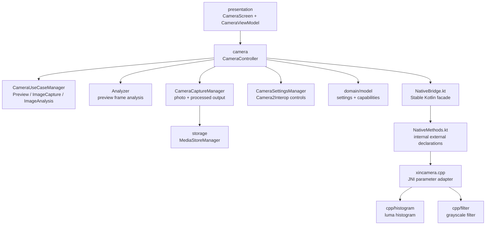

# XinCamera


一个基于 **CameraX + Jetpack Compose + JNI/C++** 的 Android 相机学习项目。

XinCamera 的目标不是做一个商业级相机，而是把真实相机 App 中常见的预览、拍摄、专业参数、图像分析和 native 图像处理拆成清晰模块，帮助你系统学习：

- CameraX 预览、拍照、缩放、对焦、闪光灯和镜头切换
- Camera2Interop 下发 ISO、快门速度、白平衡等专业参数
- Compose 构建沉浸式相机界面
- JNI 从 Kotlin 调用 C++ 图像算法
- C++ 处理 YUV / ARGB 像素数据
- MediaStore 保存照片到系统相册

## Preview

当前主界面采用沉浸式相机布局：

- 顶部 AppBar：Setting、镜头切换、闪光灯
- 中间区域：CameraX 实时预览和直方图叠层
- 底部 BottomBar：Photo / 拍摄按钮 / Video
- Setting Panel：调节 ISO、快门速度、白平衡

## Features

### Camera

- 实时预览：基于 `PreviewView` + `CameraX Preview`
- 拍照保存：通过 `ImageCapture` 写入系统相册
- 镜头切换：支持前后摄像头切换
- 变焦控制：支持滑杆和双指缩放
- 点击对焦：支持 AF / AE / AWB metering
- 闪光灯：支持可用性检测和开关控制
- 沉浸式界面：启动后隐藏状态栏，内容延伸到屏幕顶部

### Pro Controls

- ISO 调节
- 快门速度调节
- 白平衡预设
- Camera2Interop 专业参数下发
- 自动检测当前镜头是否支持手动曝光

### Native Image Processing

- JNI 加载 `xincamera` native library
- C++ 计算实时亮度直方图
- C++ 将 ARGB_8888 图片转换为灰度图
- Kotlin 负责 Bitmap / URI / MediaStore，C++ 专注像素算法

## Tech Stack

| Layer | Tech |
| --- | --- |
| Language | Kotlin, C++ |
| UI | Jetpack Compose, Material 3 |
| Camera | CameraX, Camera2Interop |
| Native | JNI, CMake, Android NDK |
| Storage | MediaStore |
| Build | Gradle Kotlin DSL, Android Gradle Plugin |

## Architecture



## Project Structure

```text
XinCamera
├── app
│   ├── src/main/java/com/seanchen/xincamera
│   │   ├── MainActivity.kt
│   │   ├── camera
│   │   │   ├── Analyzer.kt
│   │   │   ├── CameraCapabilities.kt
│   │   │   ├── CameraCaptureManager.kt
│   │   │   ├── CameraController.kt
│   │   │   ├── CameraPreviewController.kt
│   │   │   ├── CameraSettingsManager.kt
│   │   │   └── CameraUseCaseManager.kt
│   │   ├── domain
│   │   │   └── model
│   │   │       └── CameraModels.kt
│   │   ├── nativebridge
│   │   │   ├── NativeBridge.kt
│   │   │   ├── NativeLibraryLoader.kt
│   │   │   └── NativeMethods.kt
│   │   ├── presentation
│   │   │   ├── CameraScreen.kt
│   │   │   └── CameraViewModel.kt
│   │   ├── storage
│   │   │   └── MediaStoreManager.kt
│   │   └── ui
│   │       └── theme
│   │           └── XinCameraTheme.kt
│   └── src/main/cpp
│       ├── filter
│       │   ├── grayscale_filter.cpp
│       │   └── grayscale_filter.h
│       ├── histogram
│       │   ├── luma_histogram.cpp
│       │   └── luma_histogram.h
│       ├── CMakeLists.txt
│       └── xincamera.cpp
├── gradle/libs.versions.toml
└── README.md
```

## Architecture Notes

这个项目采用接近企业项目的 JNI 分层方式：

- `presentation`：只处理 Compose UI 和页面状态入口，不直接触碰 CameraX / JNI / MediaStore 细节。
- `domain/model`：放稳定业务模型，例如专业参数、镜头能力和白平衡枚举。
- `camera`：相机能力编排层。`CameraController` 是总入口，UseCase、Analyzer、Capture、Settings 分别拆分。
- `nativebridge`：Kotlin 到 C++ 的边界。业务代码只调用 `NativeBridge`，`external fun` 集中在 `NativeMethods`。
- `storage`：封装 MediaStore，统一处理 Android 版本兼容、pending 状态和失败回滚。
- `cpp`：JNI 入口和 C++ 算法分离。`xincamera.cpp` 只做参数适配，算法按类型放到 `histogram`、`filter` 等目录。

```text
JNI call flow:

CameraController
└── NativeBridge
    └── NativeMethods external fun
        └── xincamera.cpp JNI adapter
            ├── histogram/luma_histogram.cpp
            └── filter/grayscale_filter.cpp
```

## Getting Started

### Requirements

- Android Studio 最新稳定版或较新的 Canary 版本
- Android SDK 37
- Android NDK
- CMake 3.22.1+
- JDK 11+
- 一台真机或支持 CameraX 的模拟器

建议使用真机运行。相机、闪光灯、手动曝光等能力在模拟器上可能不完整。

### Clone

```bash
git clone <your-repo-url>
cd XinCamera
```

### Build

```bash
./gradlew :app:assembleDebug
```

### Install

```bash
./gradlew :app:installDebug
```

也可以直接用 Android Studio 打开项目并运行 `app`。

## How It Works

### 1. CameraX Preview

`CameraController` 负责对外编排，`CameraUseCaseManager` 负责绑定 CameraX use cases：

- `Preview`：显示实时画面
- `ImageCapture`：拍照并保存到系统相册
- `ImageAnalysis`：读取实时帧，交给 native 计算直方图

### 2. Pro Mode

专业模式通过 Camera2Interop 写入 capture request：

- 自动曝光关闭后写入 `SENSOR_SENSITIVITY`
- 快门速度写入 `SENSOR_EXPOSURE_TIME`
- 白平衡写入 `CONTROL_AWB_MODE`

设备能力来自 `CameraCharacteristics`。如果当前镜头不支持手动曝光，UI 会禁用相关控制。

### 3. Histogram

实时预览帧使用 `YUV_420_888` 格式。直方图只需要亮度信息，因此 C++ 只读取 Y plane：

```kotlin
NativeBridge.computeLumaHistogram(
    yPlane = yBytes,
    width = imageProxy.width,
    height = imageProxy.height,
    rowStride = yPlane.rowStride,
    pixelStride = yPlane.pixelStride
)
```

C++ 返回固定 256 个 bucket，索引 `0` 表示最暗，`255` 表示最亮。

### 4. Grayscale

灰度处理流程：

```text
Gallery Uri -> Bitmap ARGB_8888 -> IntArray -> JNI -> C++ grayscale -> Bitmap -> MediaStore
```

C++ 中使用 Rec.601 亮度近似公式：

```cpp
gray = 0.299R + 0.587G + 0.114B
```

当前实现使用整数权重优化：

```cpp
gray = (77 * red + 150 * green + 29 * blue) >> 8
```

## Learning Path

如果你是为了学习 JNI 和 Android 相机开发，可以按下面顺序阅读：

1. `MainActivity.kt`：应用入口、沉浸式窗口、native library 状态
2. `presentation/CameraScreen.kt`：Compose 相机 UI 和交互状态
3. `camera/CameraController.kt`：相机模块总入口
4. `camera/CameraUseCaseManager.kt`：CameraX use case 创建和绑定
5. `camera/Analyzer.kt`：预览帧分析和直方图调用
6. `camera/CameraCaptureManager.kt`：拍照和灰度图输出
7. `storage/MediaStoreManager.kt`：系统相册读写
8. `nativebridge/NativeBridge.kt`：Kotlin 业务层调用的稳定 native facade
9. `nativebridge/NativeMethods.kt`：集中声明 `external fun`
10. `xincamera.cpp`：JNI 函数签名、参数检查、Java / C++ 数组转换
11. `histogram/luma_histogram.cpp` 和 `filter/grayscale_filter.cpp`：不依赖 JNI 的 C++ 图像算法
12. `CMakeLists.txt`：native library 构建配置

## Roadmap

- [x] 第一部分：实时预览
- [x] 第二部分：专业模式
- [x] 第三部分：JNI/C++ 直方图
- [x] 第四部分：JNI/C++ 灰度图
- [ ] 第五部分：JNI/C++ 旋转图片
- [ ] 第六部分：裁剪图片
- [ ] 第七部分：镜像
- [ ] 第八部分：模糊
- [ ] 第九部分：锐化
- [ ] 第十部分：边缘检测
- [ ] OpenGL ES 渲染管线
- [ ] 视频录制模式
- [ ] 单元测试和 native 算法测试

## Common Commands

```bash
# Kotlin 编译检查
./gradlew :app:compileDebugKotlin

# 构建 Debug APK
./gradlew :app:assembleDebug

# 安装到已连接设备
./gradlew :app:installDebug
```

## Notes

- 需要授予相机权限才能进入预览。
- Android 10+ 使用 MediaStore 保存照片，不需要传统外部存储写权限。
- Android 9 及以下保留 `WRITE_EXTERNAL_STORAGE`，并通过 `maxSdkVersion=28` 限制权限范围。
- 手动 ISO / 快门依赖设备硬件能力，不同手机表现可能不同。
- JNI 方法名必须与包名、类名、方法名严格匹配。

## Contributing

欢迎把这个项目作为学习模板继续扩展。建议提交 PR 时说明：

- 改动目的
- 涉及模块
- 测试设备和 Android 版本
- 是否影响 JNI 签名或 native 构建

## License

当前仓库暂未声明开源许可证。使用、分发或二次开发前，请先确认许可证策略。
