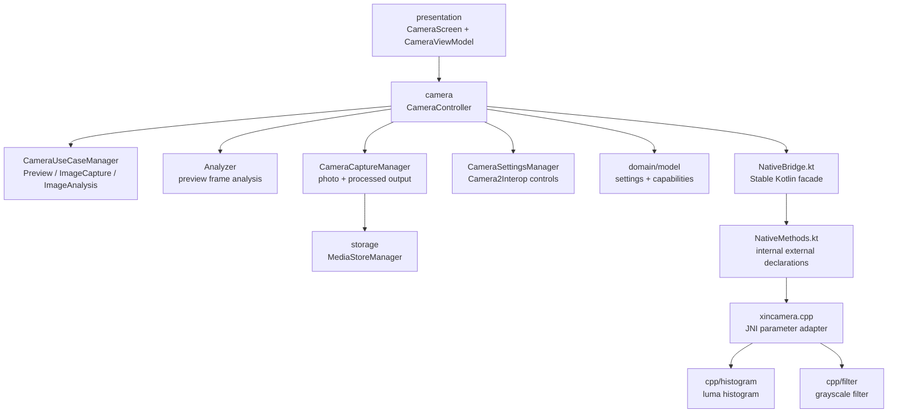

<div align="center">


# XinCamera

基于 JNI 和Jetpack Compose 的相机程序

<div align="center">
    <a href="README_EN.md">🌍 English</a>
</div>


</div>

## 📖 项目简介

这是一个基于 CameraX 、 Jetpack Compose 和 JNI/C++ 打造的开源相机学习项目，当前已实现基本功能。
XinCamera 的目标不仅仅是做一个相机APP，而是把专业相机中常见的预览、拍摄、专业参数、直方图和Raw图像处理拆成清晰模块，
帮助你系统学习JNI开发技术：

作为个人开发者，我将平常的业余时间投入到这个项目中，我将不断完善这个项目，和大家一起探讨这个项目

> 如果项目对您有帮助，请给个 Star 支持 ⭐ 这对我来说很重要，能给我带来长期更新维护的动力！

## 功能
- CameraX 预览、拍照、缩放、对焦、闪光灯和镜头切换
- Camera2Interop 下发 ISO、快门速度、白平衡等专业参数
- JNI 从 Kotlin 调用 C++ 图像算法实现直方图、RAW拍摄、灰度图


## 架构



## 项目框架

```text
XinCamera
├── app
│   ├── src/main/java/com/seanchen/xincamera
│   │   ├── MainActivity.kt
│   │   ├── camera
│   │   │   ├── Analyzer.kt
│   │   │   ├── CameraCapabilities.kt
│   │   │   ├── CameraCaptureManager.kt
│   │   │   ├── CameraController.kt
│   │   │   ├── CameraPreviewController.kt
│   │   │   ├── CameraSettingsManager.kt
│   │   │   └── CameraUseCaseManager.kt
│   │   ├── domain
│   │   │   ├── usecase
│   │   │   └── model
│   │   │       └── CameraModels.kt
│   │   ├── nativebridge
│   │   │   ├── NativeBridge.kt
│   │   │   ├── NativeLibraryLoader.kt
│   │   │   └── NativeMethods.kt
│   │   ├── presentation
│   │   │   ├── CameraScreen.kt
│   │   │   └── CameraViewModel.kt
│   │   ├── storage
│   │   │   └── MediaStoreManager.kt
│   └── src/main/cpp
│       ├── filter
│       │   ├── grayscale_filter.cpp
│       │   └── grayscale_filter.h
│       ├── histogram
│       │   ├── luma_histogram.cpp
│       │   └── luma_histogram.h
│       ├── CMakeLists.txt
│       └── xincamera.cpp
├── core
│   ├── ui
│   └── designsystem
│       └── theme
│           └── Theme.kt
├── gradle/libs.versions.toml
└── README.md
```

## 开始

```bash
# 克隆项目
git clone git@github.com:Akiha678/XinCamera.git
# 进入项目目录
cd XinCamera
# 构建项目
./gradlew :app:assembleDebug
# 安装项目
./gradlew :app:installDebug
```

也可以直接用 Android Studio 打开项目并运行 `app`。

## 怎么用

### 1. 预览

`CameraController` 负责对外编排，`CameraUseCaseManager` 负责绑定 CameraX use cases：

- `Preview`：显示实时画面
- `ImageCapture`：拍照并保存到系统相册
- `ImageAnalysis`：读取实时帧，交给 native 计算直方图

### 2. 亮度直方图实现

实时预览帧使用 `YUV_420_888` 格式。直方图只需要亮度信息，因此 C++ 只读取 Y plane：

```kotlin
NativeBridge.computeLumaHistogram(
    yPlane = yBytes,
    width = imageProxy.width,
    height = imageProxy.height,
    rowStride = yPlane.rowStride,
    pixelStride = yPlane.pixelStride
)
```

C++ 返回固定 256 个 bucket，索引 `0` 表示最暗，`255` 表示最亮。

### 3. 灰度处理

灰度处理流程：

```text
Gallery Uri -> Bitmap ARGB_8888 -> IntArray -> JNI -> C++ grayscale -> Bitmap -> MediaStore
```

C++ 中使用 Rec.601 亮度近似公式：

```cpp
gray = 0.299R + 0.587G + 0.114B
```

当前实现使用整数权重优化：

```cpp
gray = (77 * red + 150 * green + 29 * blue) >> 8
```

## Roadmap

- [x] 第一部分：实时预览
- [x] 第二部分：专业模式
- [x] 第三部分：JNI/C++ 直方图
- [x] 第四部分：JNI/C++ 灰度图
- [ ] 第五部分：JNI/C++ 旋转图片
- [x] 第六部分：RAW拍摄
- [ ] 第七部分：美颜
- [ ] 第八部分：LUT滤镜
- [ ] 第九部分：HDR
- [ ] 第十部分：锐化
- [ ] 第十一部分：边缘检测
- [ ] 视频录制模式

## Common Commands

```bash
# Kotlin 编译检查
./gradlew :app:compileDebugKotlin

# 构建 Debug APK
./gradlew :app:assembleDebug

# 安装到已连接设备
./gradlew :app:installDebug

# 打包
./gradlew clean :app:assembleRelease
```

## 👥 联系方式
欢迎添加我的联系方式。

<div align="left">
    
</div>

## 🤝 参与贡献
欢迎提交 Issue 和 Pull Request，一起完善开发体验。

- 代码贡献：完善功能实现、修复问题或补充测试
- 问题反馈：提交可复现的 Bug、兼容性问题或功能建议
- 文档优化：完善使用说明、架构文档和示例说明
- 设计支持：提供 UI、交互和多端适配建议
- 提交代码前请确保通过项目静态分析与相关测试，并遵循现有目录结构和编码规范。
