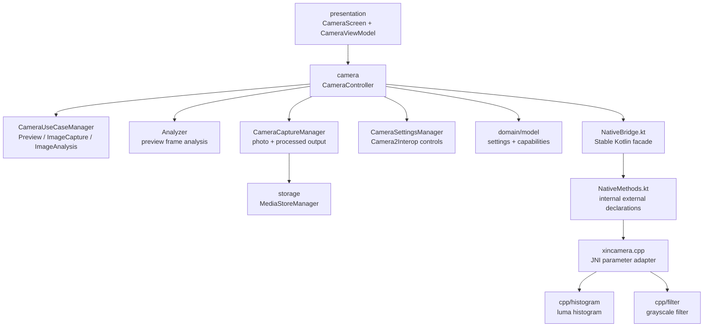

<div align="center">


# XinCamera

A camera application built with JNI and Jetpack Compose

<div align="center">
    <a href="README.md">🌍 中文</a>
</div>


</div>

## 📖 Introduction

XinCamera is an open-source camera learning project built with CameraX, Jetpack Compose, and JNI/C++. It currently provides the fundamental camera features.
Rather than being just another camera app, XinCamera breaks down common professional-camera capabilities—including preview, capture, manual controls, histograms, and RAW image processing—into clear, focused modules to help you systematically learn JNI development.

As an independent developer, I work on this project in my spare time. I will continue improving it and look forward to discussing and building it together with the community.

> If this project helps you, please consider giving it a Star ⭐. Your support means a lot to me and motivates me to keep maintaining and improving the project over the long term!

## Features

- CameraX preview, photo capture, zoom, focus, flash, and camera switching
- Professional controls such as ISO, shutter speed, and white balance through Camera2Interop
- Kotlin-to-C++ image algorithms through JNI, including histograms, RAW capture, and grayscale processing


## Architecture



## Project Structure

```text
XinCamera
├── app
│   ├── src/main/java/com/seanchen/xincamera
│   │   ├── MainActivity.kt
│   │   ├── camera
│   │   │   ├── Analyzer.kt
│   │   │   ├── CameraCapabilities.kt
│   │   │   ├── CameraCaptureManager.kt
│   │   │   ├── CameraController.kt
│   │   │   ├── CameraPreviewController.kt
│   │   │   ├── CameraSettingsManager.kt
│   │   │   └── CameraUseCaseManager.kt
│   │   ├── domain
│   │   │   ├── usecase
│   │   │   └── model
│   │   │       └── CameraModels.kt
│   │   ├── nativebridge
│   │   │   ├── NativeBridge.kt
│   │   │   ├── NativeLibraryLoader.kt
│   │   │   └── NativeMethods.kt
│   │   ├── presentation
│   │   │   ├── CameraScreen.kt
│   │   │   └── CameraViewModel.kt
│   │   ├── storage
│   │   │   └── MediaStoreManager.kt
│   └── src/main/cpp
│       ├── filter
│       │   ├── grayscale_filter.cpp
│       │   └── grayscale_filter.h
│       ├── histogram
│       │   ├── luma_histogram.cpp
│       │   └── luma_histogram.h
│       ├── CMakeLists.txt
│       └── xincamera.cpp
├── core
│   ├── ui
│   └── designsystem
│       └── theme
│           └── Theme.kt
├── gradle/libs.versions.toml
└── README.md
```

## Getting Started

```bash
# Clone the project
git clone git@github.com:Akiha678/XinCamera.git
# Enter the project directory
cd XinCamera
# Build the project
./gradlew :app:assembleDebug
# Install the app
./gradlew :app:installDebug
```

You can also open the project directly in Android Studio and run the `app` module.

## How It Works

### 1. Preview

`CameraController` coordinates the camera-facing APIs, while `CameraUseCaseManager` binds the CameraX use cases:

- `Preview`: displays the live camera feed
- `ImageCapture`: captures photos and saves them to the system gallery
- `ImageAnalysis`: reads live frames and passes them to native code for histogram calculation

### 2. Luminance Histogram

Live preview frames use the `YUV_420_888` format. Because the histogram only requires luminance information, the C++ implementation reads only the Y plane:

```kotlin
NativeBridge.computeLumaHistogram(
    yPlane = yBytes,
    width = imageProxy.width,
    height = imageProxy.height,
    rowStride = yPlane.rowStride,
    pixelStride = yPlane.pixelStride
)
```

C++ returns a fixed set of 256 buckets, where index `0` represents the darkest value and `255` represents the brightest.

### 3. Grayscale Processing

The grayscale processing pipeline is:

```text
Gallery Uri -> Bitmap ARGB_8888 -> IntArray -> JNI -> C++ grayscale -> Bitmap -> MediaStore
```

The C++ implementation uses the Rec. 601 luma approximation:

```cpp
gray = 0.299R + 0.587G + 0.114B
```

The current implementation uses optimized integer weights:

```cpp
gray = (77 * red + 150 * green + 29 * blue) >> 8
```

## Roadmap

- [x] Part 1: Live preview
- [x] Part 2: Professional mode
- [x] Part 3: JNI/C++ histogram
- [x] Part 4: JNI/C++ grayscale processing
- [ ] Part 5: JNI/C++ image rotation
- [x] Part 6: RAW capture
- [ ] Part 7: Beauty effects
- [ ] Part 8: LUT filters
- [ ] Part 9: HDR
- [ ] Part 10: Sharpening
- [ ] Part 11: Edge detection
- [ ] Video recording mode

## Common Commands

```bash
# Check Kotlin compilation
./gradlew :app:compileDebugKotlin

# Build the Debug APK
./gradlew :app:assembleDebug

# Install on a connected device
./gradlew :app:installDebug

# Build the Release APKs
./gradlew clean :app:assembleRelease
```

## 👥 Contact

Feel free to reach out using the contact information below.

<div align="left">
    
</div>

## 🤝 Contributing

Issues and pull requests are welcome. Let's improve the development experience together.

- Code contributions: improve feature implementations, fix issues, or add tests
- Bug reports: submit reproducible bugs, compatibility issues, or feature requests
- Documentation: improve usage instructions, architecture documentation, and examples
- Design support: provide suggestions for UI, interaction design, and multi-device adaptation
- Before submitting code, make sure the project passes static analysis and relevant tests, and follow the existing directory structure and coding conventions.
